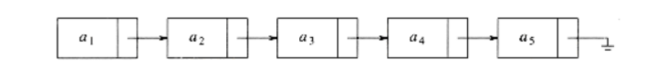

# Hello, This is Shubham Rathore
### I am a student of Gujarat University.
### I am writing this on 6th December 2020.
## This one is my repository, about data structure.
### If you find any issue in this contact me on:
[ShubhamRathore](www.shubhamrathore7567@gmail.com)
> Data Structuer is really awesome. It's algorithms are very  usefull to every developer.

> ## Abstract Data Types
> --------------------------------------------------------
>> List 
>> Tree 
>> Graphs 

>Just like the other data types, these abstract data types have methods associated with them. For set ADT, we might have such operations as _union_, _intersaction_, _size_ and _complement_

>Some popular 

>1. List: 
>> a. Array Implementation : 
>>&nbsp;&nbsp;&nbsp;&nbsp;Obviously  all of these instructions can be implemented just by using an array. Even if the array is dynamically  allocated, an estimate of the maximum size of the list is required. Usually this require high over-estimate, which wastes considerable space. This could be a serious limitation, especially if there are many lists of unknown size.  
>> b. Linked List: 
>>&nbsp;&nbsp;&nbsp;&nbsp;In Order to avoid the linear cost of insertion and deletion, we need to ensure that the list is not stored contigously, since otherwise entire part of the list will need to be moved.  
